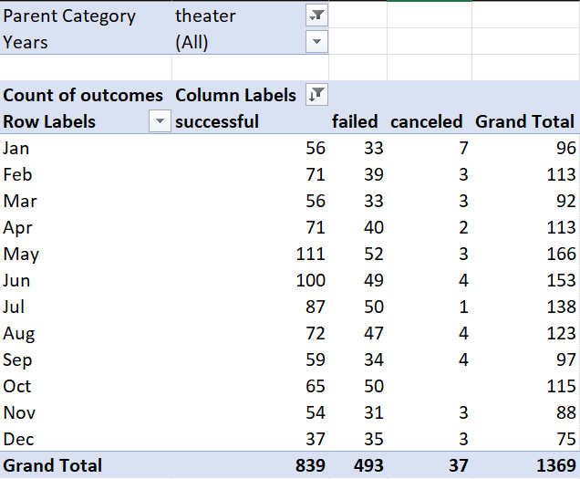

# Kickstart Analysis with Excel
Performing analysis on Kickstarter campaign data using pivot tables and graphs using excel.

## Overview of Project

### Purpose
This analysis was performed to compare how different campaigns fared in relation to their launch dates and funding goals using visualizations. The main category trends focused on theater/plays to determine campaign outcomes: successful, failed, and canceled.

### Analysis and Challenges
The initial Kickstarter campaign data was received in an excel file, where the data was cleaned, organized, and analyzed. Additional spreadsheets and pivot tables/graphs were created to further analyze the data.

[Kickstarter Challenge](https://github.com/macedo6000/kickstarter-analysis/blob/main/Kickstarter_Challenge.xlsx)

- #### Analysis of Outcomes Based on Launch Date
    - A pivot table and line graph was created to visualize the theater outcomes based on launch date. Success, failed, and canceled outcomes are represented by lines. 

        

    - The "Theater Outcomes Based on Launch Date" line graph shows that February and May have the best results for meeting goals.

        

- #### Analysis of Outcomes Based on Goals
    - The visualized funding goals analysis below shows that funding goals less than $1,000 has an almost 80% success rate.  
        

- #### Challenges and Difficulties Encountered

### Results

- What are two conclusions you can draw about the Outcomes based on Launch Date?

- What can you conclude about the Outcomes based on Goals?

- What are some limitations of this dataset?

- What are some other possible tables and/or graphs that we could create?

