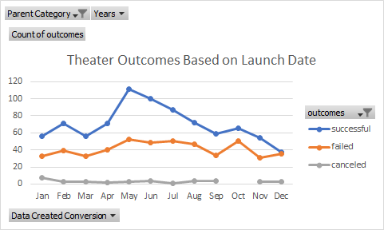
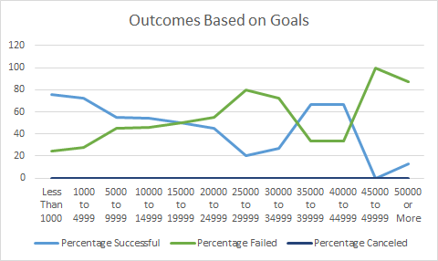

# Kickstart Analysis with Excel
Performing analysis on Kickstarter data to uncover trends.

## Overview of Project
Louise, an up-and-coming playwright, is starting a crowdfund campaign to help fund her play titled Fever. She needs insight on the dataset provided in order for her play to be a success.

### Purpose
The purpose of this analysis is to compare how different campaigns fared in relation to their launch dates and funding goals using visualizations. The main category trends will be focused on is theater/plays to determine campaign outcomes: successful, failed, and canceled.

## Analysis and Challenges
Prior to analyzing and creating visualizations for the crowdfunding campaign, the data must first be organized, sorted, and analyzed. First, the Outcomes column was color coded to help the individual outcomes stand out. Then, the category/subcategory column was separated and placed in their own column. Also, the unix timestamps were converted to readable format.

Kickstarter_Challenge.xlsx

### Analysis of Outcomes Based on Launch Date

### Analysis of Outcomes Based on Goals

### Challenges and Difficulties Encountered

## Results

- What are two conclusions you can draw about the Outcomes based on Launch Date?

- What can you conclude about the Outcomes based on Goals?

- What are some limitations of this dataset?

- What are some other possible tables and/or graphs that we could create?

